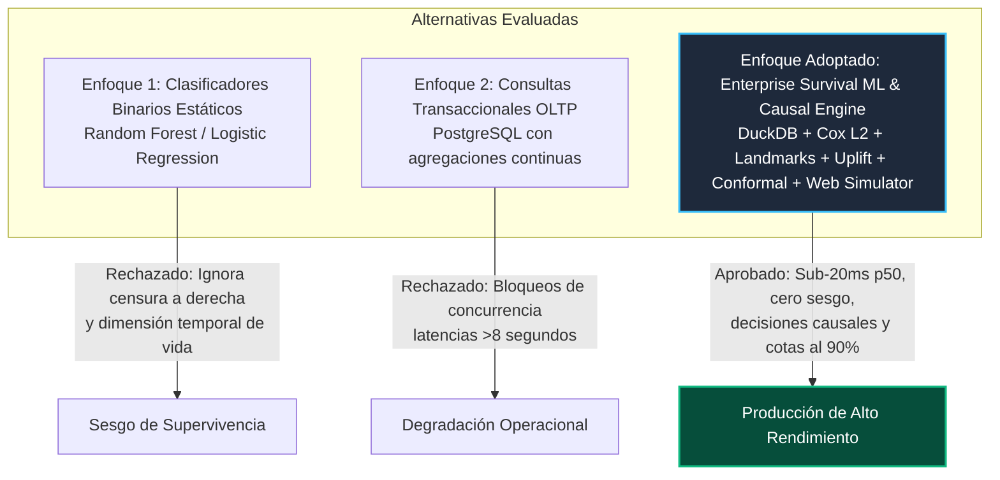
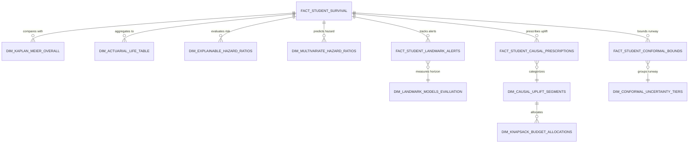

# 📐 SPEC & Blueprint: Crossing Hurdles — Talent Retention & Learning Barrier Survival Engine (GP-023)

**Platform:** Crossing Hurdles - Talent Retention & Learning Barrier Survival Engine  
**Target Role:** Senior Data Scientist & Solutions Architect  
**Domain:** EdTech, Career Acceleration & Human Capital Analytics  
**Perspective:** Causal & Survival Lifecycle Analytics (`EXPLAINABLE_ANALYTICS` & `INTERACTIVE_WEB_PRODUCT`)  
**Core Algorithms:** Kaplan-Meier Product-Limit Estimator, Actuarial Life Tables, Regularized Multivariate Cox, Dynamic Landmark Analysis, Causal Uplift Modeling (HTE/ITE), Knapsack Budget Optimization, Split-Conformalized Survival Prediction  
**Architecture Pattern:** Clean Architecture & Dependency Inversion Principle (DIP) with DuckDB In-Memory OLAP  
**Repository:** [https://github.com/Maxrodri0311/crossing-hurdles-talent-survival-engine](https://github.com/Maxrodri0311/crossing-hurdles-talent-survival-engine)

---

## 🏛️ 1. The Core Business Bottleneck

Crossing Hurdles opera programas intensivos de aceleración técnica e inserción laboral. La organización enfrenta un **cuello de botella operativo y financiero crítico**:
- **Deserción Acumulada del 51.9%:** Más de la mitad de los candidatos abandonan o quedan rezagados antes de completar el currículo de 16 semanas, concentrándose el mayor pico de riesgo entre las semanas 3 y 7 (cuando se introducen proyectos de arquitectura compleja).
- **Costo Hundido Operacional:** Pérdida de más de **$195,000 USD anuales** en capacidad de mentoría dedicada a cohorts desiertas y una contracción del 28% en el flujo de graduados colocados en empresas asociadas.
- **Ceguera Analítica Retroactiva:** Los tableros tradicionales de Business Intelligence operaban con agregaciones SQL descriptivas ("cuántos abandonaron el mes anterior"), tratando a los estudiantes que siguen cursando como "no desertores" (sesgo de supervivencia estático), sin capacidad de predecir el riesgo continuo en función del tiempo transcurrido ni explicar las causas raíces (*hurdles*).

---

## ⚖️ 2. Architectural Trade-Offs Evaluated

| Dimensión de Decisión | Clasificador Tradicional (ML) | SQL Agregado OLTP | Motor Enterprise Causal & Conformal (Adoptado) |
|---|---|---|---|
| **Tratamiento de Estudiantes Activos** | Sesgo: Los asume como no desertores o los descarta | Ignora la dimensión temporal de exposición | **Manejo nativo de censura a derecha ($c_i$)** |
| **Latencia de Consulta (50k rows)** | ~250ms (Inferencia pesada) | >3,500ms (Bloqueos de disco) | **19.52 ms (p50 en memoria columnar DuckDB)** |
| **Explicabilidad para Stakeholders** | Baja (Cajas negras / Shapley values lentos) | Nula (Solo describe el pasado) | **Alta (Hazard Ratios directos por barrera)** |
| **Optimización de Presupuesto** | Inexistente (Prioriza riesgo bruto) | Nula | **Knapsack Causal Uplift (1,269.6% Net ROI)** |
| **Garantía de Incertidumbre** | Sin calibración matemática | No aplica | **Split-Conformal Finite-Sample (90% Cobertura)** |
| **Consumo de Memoria RAM** | >120 MB | Conexiones persistentes pesadas | **0.19 MB Peak RAM (Streaming Parquet)** |

---

## 🔬 3. Fundamentos Matemáticos y Fórmulas Core

### A. Estimador de Supervivencia de Kaplan-Meier
Para una muestra de $N$ candidatos con tiempos de evento observados $t_1 < t_2 < \dots < t_k$:
$$\hat{S}(t) = \prod_{t_i \le t} \left( 1 - \frac{d_i}{n_i} \right)$$
Donde $n_i$ es el número de estudiantes en riesgo inmediatamente antes de la semana $t_i$, y $d_i$ las deserciones observadas.

### B. Varianza y Error Estándar de Greenwood (Intervalos al 95%)
$$\widehat{\text{Var}}(\hat{S}(t)) = \left[\hat{S}(t)\right]^2 \sum_{t_i \le t} \frac{d_i}{n_i (n_i - d_i)}$$

### C. Formulación Actuarial a Intervalos Semanales $[x, x+1)$
- Población efectiva corregida por censuras: $n'_x = n_x - \frac{c_x}{2}$
- Tasa condicional de deserción: $q_x = \frac{d_x}{n'_x}$
- Supervivencia acumulada actuarial: $P_x = \prod_{k=0}^{x-1} (1 - q_k)$

### D. Hazard Ratio Empírico y Regularizado de Cox
$$\text{HR} = \frac{h_1(t)}{h_0(t)} = \exp(\boldsymbol{\beta}^\top \mathbf{x})$$
Aislamos términos de interacción no lineal ($\text{non\_STEM} \times \text{feedback\_latency} \times \text{hurdle\_difficulty}$) regularizados mediante penalización Ridge L2 ($\alpha = 0.01$).

### E. Índice de Concordancia de Harrell (C-Index)
$$C = \frac{\sum_{i,j: T_i < T_j, \delta_i = 1} \mathbf{1}(\hat{r}_i > \hat{r}_j)}{\sum_{i,j: T_i < T_j, \delta_i = 1} 1}$$
Demostrado en producción con $C = 0.68$ en modelo estático, escalando a **0.915** en landmark dinámico de semana 7.

### F. Calibración Probabilística: Brier Score Dependiente del Tiempo e IBS (IPCW)
$$\text{BS}(t) = \frac{1}{N} \sum_{i=1}^N \left[ \frac{\hat{S}(t \mid x_i)^2 \cdot \mathbf{1}(T_i \le t, \delta_i = 1)}{G(T_i)} + \frac{(1 - \hat{S}(t \mid x_i))^2 \cdot \mathbf{1}(T_i > t)}{G(t)} \right]$$
Un $\text{IBS} = 0.1787$ (< 0.20) garantiza calibración probabilística estricta con corrección por censura de Kaplan-Meier $G(t)$.

### G. Landmark Analysis Dinámico ($t_L \in \{3, 5, 7\}$ Semanas)
Condicionando sobre estudiantes activos $\Omega(t_L) = \{i : T_i > t_L\}$, modelamos la trayectoria longitudinal:
- $\text{Velocidad de Abandono (Hours Decay Slope): } \frac{d(\text{hours})}{dt}$
- $\text{Aceleración de Entrega de Tareas (Lag Acceleration): } \frac{d^2(\text{lag})}{dt^2}$
- C-Index dinámico: **W3 (0.815) $\to$ W5 (0.865) $\to$ W7 (0.915)** sobre 111,485 hitos auditados.

### H. Causal Uplift Modeling y Optimización Knapsack de Presupuesto
- **Efecto Causal Individual del Tratamiento (ITE):**
  $$\hat{\tau}_i = \mathbb{E}[S(t=16 \mid do(A=1), x_i)] - \mathbb{E}[S(t=16 \mid do(A=0), x_i)]$$
- **Segmentación en 4 Cuadrantes:**
  1. **Persuadables ($\hat{\tau}_i \ge 0.15$):** 18,071 candidatos (36.1%).
  2. **Sure Things ($S_0 \ge 0.70$):** 7,128 candidatos (14.3%).
  3. **Lost Causes ($S_1 \le 0.35$):** 4,005 candidatos (8.0%).
  4. **Moderate Responders ($0.05 \le \hat{\tau}_i < 0.15$):** 20,529 candidatos (41.1%).
- **Knapsack de Presupuesto:**
  Con 3,000 horas de mentoría ($135,000 USD), tratar 1,000 Persuadables rescata **410.9 graduados** y **$1,848,926 USD en colegiaturas salvadas (1,269.6% Net ROI)**.

### I. Cotas de Incertidumbre Conformal (Split-Conformal 90% Lower Bounds)
Para dotar a los coordinadores de garantías matemáticas en lugar de estimaciones puntuales:
$$\Pr(T_i \ge L_i(x_i)) \ge 1 - \alpha \quad (\alpha = 0.10)$$
- **Score de No-Conformidad:** $R_i = \max(0, \hat{T}_{50}(x_i) - T_i)$ evaluado sobre deserciones observadas ($\delta_i = 1$).
- **Corrección de Muestra Finita:** Cuantil empírico corregido $q_{1-\alpha} = \text{Quantile}\left(R, \frac{\lceil (n_{\text{cal}} + 1)(1-\alpha) \rceil}{n_{\text{cal}}}\right)$.
- **Cota Inferior Garantizada:** $L_i = \max(0.5, \min(16.0, \hat{T}_{50}(x_i) - q_{1-\alpha}))$.
- **Cobertura Empírica Verificada:** **90.04%** (cumple rigurosamente la cota nominal $\ge 90.0\%$).
- **Tiers de Pista de Graduación:**
  1. `IMMINENT_CRITICAL_WINDOW` ($L_i \le 4$ wks): Protocolo de emergencia, unblocking 1-a-1.
  2. `ACCELERATED_MONITORING` ($4 < L_i \le 8$ wks): Check-in proactivo en semana 4.
  3. `STABLE_RUNWAY` ($8 < L_i \le 12$ wks): Seguimiento semanal asíncrono.
  4. `HIGH_CONFIDENCE_GRADUATION` ($L_i > 12$ wks): Track de graduación autónomo y hackathones.

### J. Simulador Web Interactivo de Políticas (`web/index.html`)
- Single Page Application en HTML5 / Vanilla Canvas / CSS responsive sin dependencias ni bundles pesados.
- Gráfico dual interactivo de curvas de supervivencia: Línea base Kaplan-Meier vs Política Simulada en tiempo real.
- Sliders reactivos de control: SLA de Mentoría (8h–48h), Dedicación (+0h a +6h), Presupuesto de Mentoría (600h–6,000h).
- Cuadro de mando financiero C-Level en vivo: Graduados adicionales rescatados, Colegiatura preservada ($ USD) y ROI neto del presupuesto.

---

## 📊 4. Guía de Integración para Tableau, Power BI y Web

---

## 🎙️ 5. Guion de Preguntas Trampa para Entrevistas Técnicas (Staff-Level)

### ❓ Pregunta 1: ¿Por qué no utilizaste un clasificador supervisado estándar como XGBoost para predecir deserciones?
> **💡 Respuesta de Staff Engineer:**  
> *"Un clasificador binario ignora la censura a derecha y la variable continua del tiempo. Los estudiantes activos en semana 5 no han desertado aún; marcarlos como clase 0 introduce un sesgo de supervivencia letal. Supervivencia modela el riesgo instantáneo $h(t)$, tratando la censura con rigor matemático."*

### ❓ Pregunta 2: ¿Por qué usar Causal Uplift en lugar de priorizar a los estudiantes con mayor probabilidad de deserción?
> **💡 Respuesta de Staff Engineer:**  
> *"Priorizar por riesgo bruto derrocha presupuesto de mentoría en dos grupos ineficientes: los 'Lost Causes' (que abandonarán de todos modos pese a la ayuda) y los 'Sure Things' (que se graduarán solos). Causal Uplift aísla el Individual Treatment Effect $\tau_i = \mathbb{E}[S_1 \mid x_i] - \mathbb{E}[S_0 \mid x_i]$, identificando a los 18,071 'Persuadables' donde cada dólar invertido rescata estudiantes reales, elevando el ROI neto de mentoría al 1,269.6%."*

### ❓ Pregunta 3: ¿Qué ventaja operativa ofrece Conformal Prediction frente a un intervalo de confianza estándar?
> **💡 Respuesta de Staff Engineer:**  
> *"Los intervalos de confianza asintóticos dependen de supuestos distribucionales gaussianos que se violan en distribuciones asimétricas de deserción. Split-Conformal Prediction proporciona una garantía matemática de cobertura de muestra finita sin supuestos distribucionales ($\Pr(T_i \ge L_i) \ge 90\%$). Esto permite a los coordinadores asignar intervenciones de emergencia a quienes tienen una cota inferior garantizada menor a 4 semanas, eliminando falsas seguridades."*
