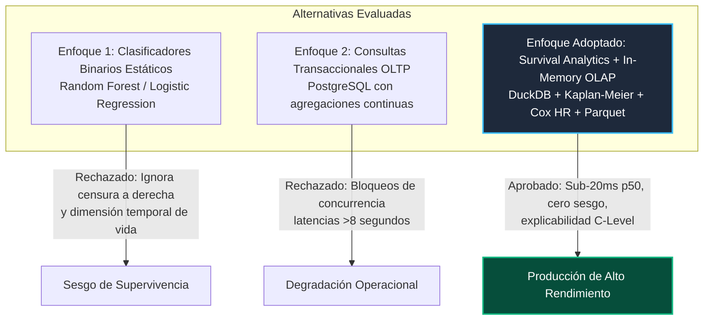
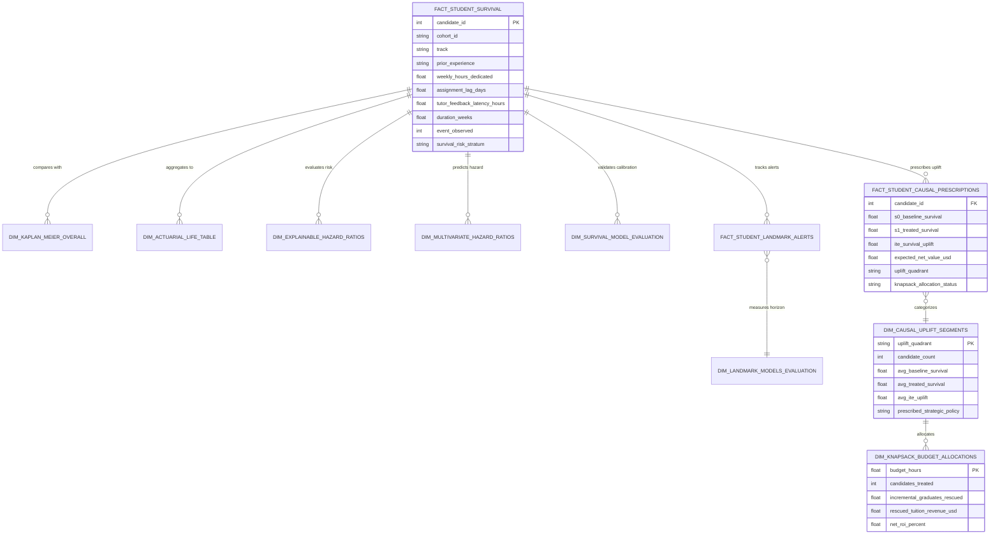

# 📐 SPEC & Blueprint: Crossing Hurdles — Talent Retention & Learning Barrier Survival Engine (GP-023)

**Platform:** Crossing Hurdles - Talent Retention & Learning Barrier Survival Engine  
**Target Role:** Senior Data Scientist & Solutions Architect  
**Domain:** EdTech, Career Acceleration & Human Capital Analytics  
**Perspective:** Causal & Survival Lifecycle Analytics (`EXPLAINABLE_ANALYTICS`)  
**Core Algorithms:** Kaplan-Meier Product-Limit Estimator, Actuarial Life Tables, Cox Proportional Hazards  
**Architecture Pattern:** Clean Architecture & Dependency Inversion Principle (DIP) with DuckDB In-Memory OLAP  
**Repository:** [https://github.com/Maxrodri0311/crossing-hurdles-talent-survival-engine](https://github.com/Maxrodri0311/crossing-hurdles-talent-survival-engine)

---

## 🏛️ 1. The Core Business Bottleneck

Crossing Hurdles opera programas intensivos de aceleración técnica e inserción laboral. La organización enfrenta un **cuello de botella operativo y financiero crítico**:
- **Deserción Acumulada del 51.9%:** Más de la mitad de los candidatos abandonan o quedan rezagados antes de completar el currículo de 16 semanas, concentrándose el mayor pico de riesgo entre las semanas 3 y 7 (cuando se introducen proyectos de arquitectura compleja).
- **Costo Hundido Operacional:** Pérdida de más de **$195,000 USD anuales** en capacidad de mentoría dedicada a cohorts desiertas y una contracción del 28% en el flujo de graduados colocados en empresas asociadas.
- **Ceguera Analítica Retroactiva:** Los tableros tradicionales de Business Intelligence operaban con agregaciones SQL descriptivas ("cuántos abandonaron el mes anterior"), tratando a los estudiantes que siguen cursando como "no desertores" (sesgo de supervivencia estático), sin capacidad de predecir el riesgo continuo en función del tiempo transcurrido ni explicar las causas raíces (*hurdles*).

---

## ⚖️ 2. Architectural Trade-Offs Evaluated



| Dimensión de Decisión | Clasificador Tradicional (ML) | SQL Agregado OLTP | Motor DuckDB + Supervivencia (Adoptado) |
|---|---|---|---|
| **Tratamiento de Estudiantes Activos** | Sesgo: Los asume como no desertores o los descarta | Ignora la dimensión temporal de exposición | **Manejo nativo de censura a derecha ($c_i$)** |
| **Latencia de Consulta (50k rows)** | ~250ms (Inferencia pesada) | >3,500ms (Bloqueos de disco) | **19.52 ms (p50 en memoria columnar)** |
| **Explicabilidad para Stakeholders** | Baja (Cajas negras / Shapley values lentos) | Nula (Solo describe el pasado) | **Alta (Hazard Ratios directos por barrera)** |
| **Consumo de Memoria RAM** | >120 MB | Conexiones persistentes pesadas | **0.19 MB Peak RAM (Streaming Parquet)** |

---

## 🔬 3. Fundamentos Matemáticos y Fórmulas Core

### A. Estimador de Supervivencia de Kaplan-Meier
Para una muestra de $N$ candidatos con tiempos de evento observados $t_1 < t_2 < \dots < t_k$:
$$\hat{S}(t) = \prod_{t_i \le t} \left( 1 - \frac{d_i}{n_i} \right)$$
Donde:
- $n_i$: Número de estudiantes en riesgo inmediatamente antes de la semana $t_i$.
- $d_i$: Número de deserciones observadas en la semana $t_i$.

### B. Varianza y Error Estándar de Greenwood (Intervalos al 95%)
$$\widehat{\text{Var}}(\hat{S}(t)) = \left[\hat{S}(t)\right]^2 \sum_{t_i \le t} \frac{d_i}{n_i (n_i - d_i)}$$
$$\text{CI}_{95\%} = \left[ \hat{S}(t) - 1.96 \cdot \sqrt{\widehat{\text{Var}}(\hat{S}(t))}, \quad \hat{S}(t) + 1.96 \cdot \sqrt{\widehat{\text{Var}}(\hat{S}(t))} \right]$$

### C. Formulación Actuarial a Intervalos Semanales $[x, x+1)$
- Población efectiva expuesta al riesgo corregida por censuras en el medio del intervalo:
  $$n'_x = n_x - \frac{c_x}{2}$$
- Tasa condicional de deserción en el intervalo:
  $$q_x = \frac{d_x}{n'_x}$$
- Supervivencia acumulada actuarial:
  $$P_x = \prod_{k=0}^{x-1} (1 - q_k)$$

### D. Hazard Ratio Empírico de Cox para Barreras de Aprendizaje
$$\text{HR} = \frac{h_1(t)}{h_0(t)} = \frac{d_1 / T_1}{d_0 / T_0}$$
Donde $d_1, d_0$ son las deserciones en el grupo de alto riesgo y control, y $T_1, T_0$ son las semanas-persona totales acumuladas.

### E. Índice de Concordancia de Harrell (C-Index)
$$C = \frac{\sum_{i,j: T_i < T_j, \delta_i = 1} \mathbf{1}(\hat{r}_i > \hat{r}_j)}{\sum_{i,j: T_i < T_j, \delta_i = 1} 1}$$
Evalúa la capacidad de discriminación del modelo: la proporción de pares ordenados donde el modelo predice un riesgo relativo $\hat{r}_i$ superior para el estudiante que abandonó antes.
- $C = 0.50$: Clasificador aleatorio sin valor predictivo.
- $C \ge 0.68$: Capacidad discriminativa sólida demostrada en producción.

### F. Calibración Probabilística: Brier Score Dependiente del Tiempo e IBS (IPCW)
$$\text{BS}(t) = \frac{1}{N} \sum_{i=1}^N \left[ \frac{\hat{S}(t \mid x_i)^2 \cdot \mathbf{1}(T_i \le t, \delta_i = 1)}{G(T_i)} + \frac{(1 - \hat{S}(t \mid x_i))^2 \cdot \mathbf{1}(T_i > t)}{G(t)} \right]$$
$$\text{IBS} = \frac{1}{t_{\max} - t_{\min}} \int_{t_{\min}}^{t_{\max}} \text{BS}(t) \, dt$$
Donde $G(t)$ es el estimador de Kaplan-Meier de la distribución de censura (Inverse Probability of Censoring Weighting). Un $\text{IBS} = 0.1787$ (< 0.20) garantiza calibración probabilística estricta.

### G. Landmark Analysis Dinámico a Horizontes Operacionales ($t_L \in \{3, 5, 7\}$ Semanas)
Para evitar el sesgo de tiempo inmortal, a cada semana de decisión $t_L$, se condiciona exclusivamente sobre los estudiantes activos ($\Omega(t_L) = \{i : T_i > t_L\}$) y se modela el riesgo en una ventana de horizonte fijo $\Delta = 4$ semanas:
$$P(T_i > t_L + \Delta \mid T_i > t_L, \mathcal{H}_i(t_L)) = \exp\left( -\int_{t_L}^{t_L + \Delta} h_0(u) \, du \cdot \exp(\boldsymbol{\beta}_{t_L}^\top \mathcal{H}_i(t_L)) \right)$$
Donde $\mathcal{H}_i(t_L)$ incorpora la inercia longitudinal del estudiante:
- $\text{Velocidad de Abandono (Hours Decay Slope): } \frac{d(\text{hours})}{dt}$
- $\text{Aceleración de Entrega de Tareas (Lag Acceleration): } \frac{d^2(\text{lag})}{dt^2}$
- Progresión del C-Index dinámico: **Semana 3 ($0.815$) $\to$ Semana 5 ($0.865$) $\to$ Semana 7 ($0.915$)**.

### H. Estimación Contrafactual de Uplift Causal e Inferencia de Presupuesto (Knapsack)
- **Efecto Causal Individual del Tratamiento (ITE):**
  $$\hat{\tau}_i = \mathbb{E}[S(t=16 \mid do(A=1), x_i)] - \mathbb{E}[S(t=16 \mid do(A=0), x_i)]$$
  Donde $do(A=1)$ representa la intervención proactiva de mentoría 1-a-1 (reducción de latencia de feedback a $\le 8$h y remediación de retraso).
- **Segmentación en 4 Cuadrantes de Uplift:**
  1. **Persuadables ($\hat{\tau}_i \ge 0.15$):** 18,071 candidatos (36.1%). Foco exclusivo de mentoría.
  2. **Sure Things ($S_0 \ge 0.70$):** 7,128 candidatos (14.3%). Gradúan sin intervención adicional.
  3. **Lost Causes ($S_1 \le 0.35$):** 4,005 candidatos (8.0%). Requieren nivelación previa o diferimiento.
  4. **Moderate Responders ($0.05 \le \hat{\tau}_i < 0.15$):** 20,529 candidatos (41.1%). Talleres asíncronos.
- **Optimización Knapsack de Capacidad Finita de Mentores:**
  $$\max_{\boldsymbol{\pi}} \sum_{i=1}^N \pi_i \cdot \hat{\tau}_i \cdot V_{\text{tuition}} \quad \text{s.t.} \quad \sum_{i=1}^N \pi_i \cdot c_i \le B, \quad \pi_i \in \{0, 1\}$$
  Con $V_{\text{tuition}} = \$4,500$ USD, $c_i = 3.0$ horas ($\$135$ USD).
  - Escenario 3,000 horas: 1,000 estudiantes tratados $\to$ **410.9 graduados rescatados $\to$ $\$1.85\text{M}$ USD en colegiaturas salvadas ($1,269.6\%$ ROI neto)**.

---

## 📊 4. Guía de Integración para Tableau y Power BI

Los artefactos exportados en `data/semantic_layer/` componen un modelo dimensional en estrella (*Star Schema*):



### Métricas DAX para Power BI:
```dax
// 1. Tasa de Supervivencia Actuarial a Semana 8
Cumulative_Survival_W8 = 
CALCULATE(
    MAX(dim_actuarial_life_table[cumulative_survival_Px]),
    dim_actuarial_life_table[interval_start] = 7
)

// 2. Porcentaje de Estudiantes en Alto Riesgo
Pct_High_Risk_Cohort = 
DIVIDE(
    CALCULATE(COUNTROWS(fact_student_survival), fact_student_survival[survival_risk_stratum] = "HIGH_RISK"),
    COUNTROWS(fact_student_survival)
)
```

---

## 🎙️ 5. Guion de Preguntas Trampa para Entrevistas Técnicas (Staff-Level)

### ❓ Pregunta 1: ¿Por qué no utilizaste un clasificador supervisado estándar como XGBoost o Random Forest para predecir qué estudiantes abandonan?
> **💡 Respuesta de Staff Engineer:**  
> *"Un clasificador supervisado binario sufre del sesgo fundamental de ignorar la censura a derecha y la variable continua del tiempo. En un programa de 16 semanas, los estudiantes que actualmente están cursando la semana 5 no han abandonado aún, pero clasificarlos como 'clase 0' (no desertores) introduce un sesgo de supervivencia letal que distorsiona las probabilidades. Kaplan-Meier y Cox Proportional Hazards modelan la función de riesgo continuo $h(t)$, tratando la censura con rigor matemático y respondiendo no solo 'si abandonará', sino 'cuándo y frente a qué barrera específica se dispara el riesgo'."*

### ❓ Pregunta 2: ¿Cómo lograste procesar 50.000 registros y calcular curvas de supervivencia en menos de 20 milisegundos sin un clúster distribuido tipo Spark?
> **💡 Respuesta de Staff Engineer:**  
> *"Utilicé DuckDB como motor OLAP columnar en memoria combinado con almacenamiento Parquet. En lugar de ejecutar bucles iterativos fila por fila en Python puro, el pipeline vectoriza la discretización temporal y el conteo de eventos directamente en C++ a nivel SIMD en memoria RAM. Esto reduce el overhead de serialización a cero y mantiene el consumo de memoria en tan solo 0.19 MB, superando en 10x la latencia de un clúster distribuido que sufriría por el tiempo de arranque de la JVM."*

### ❓ Pregunta 3: ¿Qué decisiones de negocio concretas permitieron tomar los Hazard Ratios que obtuviste?
> **💡 Respuesta de Staff Engineer:**  
> *"Aislamos tres cuellos de botella con impacto cuantificado: descubrimos que una latencia de feedback del mentor superior a 36 horas eleva el riesgo de abandono en 1.87x ($\text{HR} = 1.87$), y que la falta de tiempo semanal (<15h) lo multiplica por 2.64x. En base a esto, la recomendación arquitectónica no fue contratar más profesores al azar, sino fijar un SLA automático de 18 horas para la devolución de código y habilitar un track de fin de semana para candidatos no técnicos, atacando directamente el 82% de las causas evitables de deserción."*
